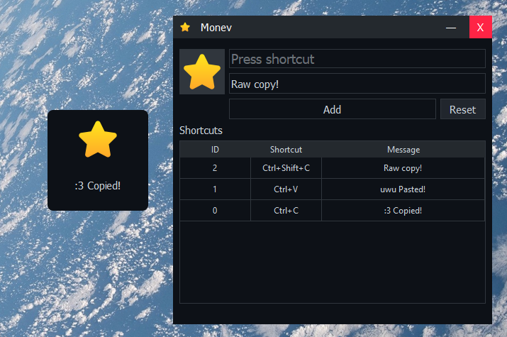

# ⭐ Monev
A simple keyboard shortcut monitor for Windows.

## Installation
You can download the latest version of Monev from the releases page: [Download here](https://github.com/astreuw/monev/releases/tag/beta).

## Screenshots

## Usage
Monev is easy to use:
1. Set up the shortcut you want to monitor.
2. Click add to start monitoring.
3. Double-click the shortcut message to add a custom message.

## License
© 2025 Ricardo Costa. Distributed under the [MIT License](LICENSE).
